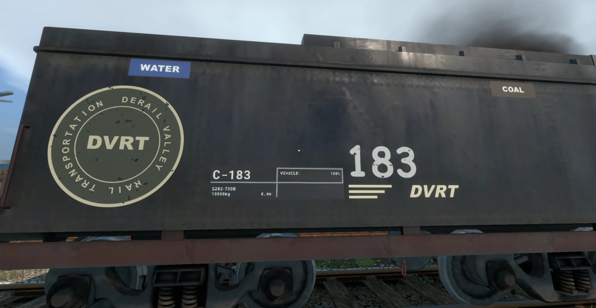
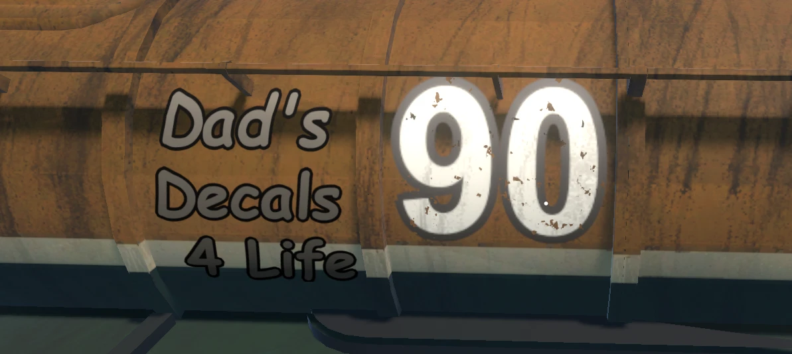
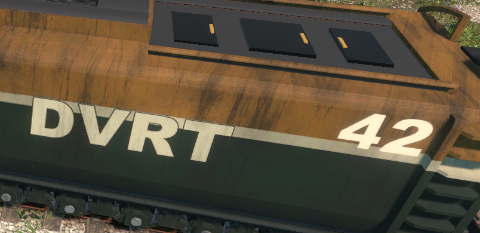
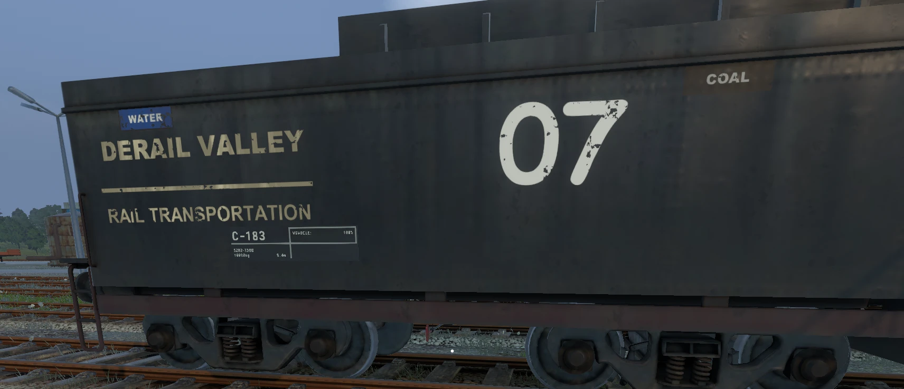
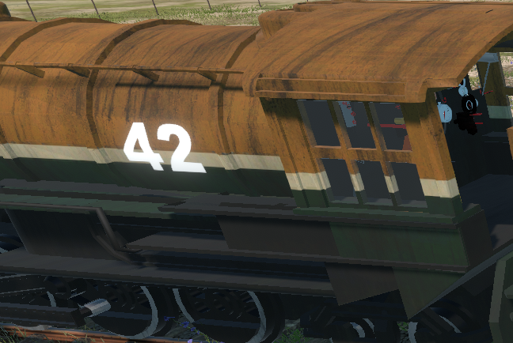

# Dad's Decals

A Derail Valley mod for putting decals on locomotives, tenders and wagons: road numbers, logos, warning stripes, placards, anything you have as a PNG or can type. Decals wrap around curved and angled surfaces, sit in the game's lighting, shadows and fog, and every car keeps its own layout in your save.



**Status: pre-release (v0.2.0).** It works well in testing, but expect rough edges. Please report problems on the [issue tracker](https://github.com/james-taplin/dads-decals/issues).

## Features
- **Works on any car**: vanilla and custom (CCL) locos, tenders and wagons. Loco authors don't need to do anything.
- **Place with the mouse**: a live preview follows the cursor (the exterior camera works too).
- **Edit placed decals**: select, drag, change any setting live, duplicate, delete, undo/redo.
- **Keep level, snapping and mirror to the other side**: linked twins follow your edits.
- **Text decals**: any font installed in Windows, with outline, bold/italic and alignment.
- **Auto road numbers**: `{n}` becomes 42 on L-042. One layout can number a whole fleet.
- **Paint look**: colour picker with an eyedropper, finish presets, glow, procedural grime and chipping.
- **Layouts**: saved per car in your save, templates per livery, copy between cars, export/import for sharing, and a layout per paint scheme (including Skin Manager skins).
- **Example decals included**: warning stripes, OSHA-style placards, voltage labels, fuel labels, access markings and DVRT-style logos.

| | |
|---|---|
|  |  |
|  |  |

## Requirements
- [Unity Mod Manager](https://www.nexusmods.com/site/mods/21)
- [Mod Toolbar](https://github.com/imagitama/derail-valley-mod-toolbar) (the Decals window lives in it)

## Quick start
1. Download `DadsDecals-<version>.zip` from [Releases](https://github.com/james-taplin/dads-decals/releases) and install it with Unity Mod Manager.
2. In game, free the cursor and click **Decals** on the Mod Toolbar.
3. Click an image in the **Place** tab, point at a car and left-click.

The full guide is in the **[wiki](wiki/Home.md)**:
- [Installation](wiki/Installation.md)
- [Placing decals](wiki/Placing-Decals.md)
- [Editing decals](wiki/Editing-Decals.md)
- [Text and road numbers](wiki/Text-and-Road-Numbers.md)
- [Colour, finish and weathering](wiki/Colour-Finish-and-Weathering.md)
- [Layouts and sharing](wiki/Layouts-and-Sharing.md)
- [Your own images](wiki/Your-Own-Images.md)
- [FAQ and troubleshooting](wiki/FAQ-and-Troubleshooting.md)
- [How it works](wiki/How-It-Works.md)

What's new: see the [changelog](CHANGELOG.md).

## Building from source
Needs the .NET SDK (8+) and a Derail Valley install. See [How it works](wiki/How-It-Works.md#building-from-source) for the shader and packaging scripts.

```
cd src/DadsDecals
dotnet build -c Release -p:Deploy=true
```

## Credits and licence
Code and example images are MIT licensed (see [LICENSE](LICENSE)). The projection technique was inspired by KSP's Conformal Decals; no code was taken from it.

This is a fan-made mod, not affiliated with or endorsed by Altfuture. "Derail Valley" and "DVRT" are names from the game. The DVRT-style example logos are original drawings, not the game's artwork.
