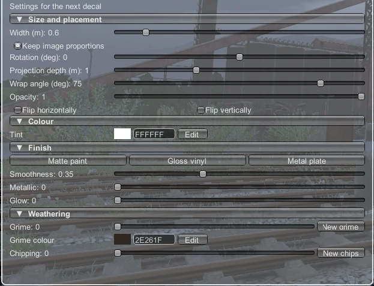
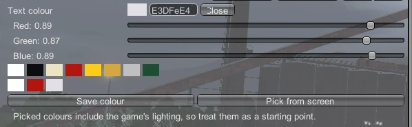

# Colour, finish and weathering

These sections appear under **Settings for the next decal** in the Place tab, and for the selected decal in the Edit tab.

## Colour
**Tint** multiplies the decal's colours:
- white leaves the image as it is;
- any other colour shades it, so a white image becomes exactly the tint colour.

That's why some examples have a white "(tintable)" version.

### The colour picker

Every colour field (tint, text colour, outline colour, grime colour) has:
- a **swatch** showing the current colour;
- a **hex box**: type a six-digit hex code like `EEE4C4`;
- **Edit**, which opens:
  - **Red / Green / Blue** sliders;
  - a row of **preset swatches**: white, black, cream, red, yellow, gold, silver, green;
  - **your saved colours**: **Save colour** adds the current colour. Click a saved swatch to use it, or right-click it to remove it. They're kept between sessions.
  - **Pick from screen**: click it, then left-click anywhere in the game world to copy that pixel's colour (right-click cancels).

> Pick from screen gives the colour as you see it, including sunlight, shadow and fog. That's a good starting point for matching a livery, but you may need to adjust it by eye.

## Finish
How the decal reflects light:

| Preset | Smoothness | Metallic | Looks like |
|---|---|---|---|
| **Matte paint** | 0.15 | 0 | Flat stencilled paint |
| **Gloss vinyl** | 0.75 | 0 | Shiny sticker or fresh paint |
| **Metal plate** | 0.55 | 0.9 | Brass or steel number plates |

You can also set **Smoothness** and **Metallic** yourself.

**Glow** makes the decal give off light, for number boards, signs or anything that should read at night. 0 is off; higher is brighter.

## Weathering
Both effects are procedural, so they work on any image, and each decal gets its own random pattern when placed.

**Grime** darkens the decal with streaks running down and blotches, like rain-washed dirt.
- **Grime**: strength. Low values give a few streaks; high values cover most of the decal.
- **New grime**: re-rolls the pattern.
- **Grime colour**: the colour of the dirt (default dark brown-grey). Try rust brown for old steam locos, or grey for road dust.
- Dirty areas also lose shine.

**Chipping** removes small flakes of the decal, like paint wearing off.
- **Chipping**: strength. Higher values mean more and bigger chips.
- **New chips**: re-rolls the pattern.

Both are in real-world units, so a small placard and a large herald get similar-sized streaks and chips.

