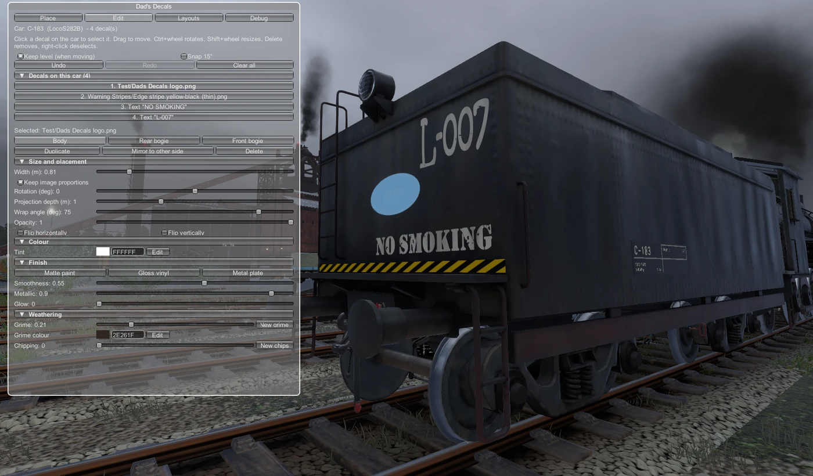

# Editing decals

Open the **Edit** tab to work on decals you've already placed.

## Selecting
- **Click a decal on the car** to select it. If decals overlap, the smallest one under the cursor wins.
- Or click it in the **Decals on this car** list. It's shown top layer first; mirrored pairs are marked *(mirrored pair)*.
- The selected decal **pulses blue** on the car. Its mirrored twin pulses too.
- **Right-click** in the world to deselect.
- Editing pauses while the Decals window is closed or the mouse is locked: the selected decal stops pulsing and clicks, keys and the mouse wheel do nothing. It's still selected when you open the window again.

## Moving and adjusting
| Input | Does |
|---|---|
| **Drag** a selected decal | Moves it over the surface, keeping its size and rotation |
| **Ctrl + wheel** | Rotate |
| **Shift + wheel** | Resize |
| **Delete** key | Delete it (and its mirrored twin) |

**Keep level (when moving)** and **Snap 15°** work as in the Place tab. Selecting a decal opens the **Decal toolbox** window beside the main one; every setting there (size, rotation, colour, finish, weathering, and the text for text decals) applies **live** to the selected decal.

## Buttons
These are at the top of the **Decal toolbox** window when a decal is selected.
- **Attached to: Body / Front bogie / Rear bogie**: which part the decal is attached to. Changing it keeps the decal where it is in the world; it just moves with a different part from then on.
- **Duplicate**: makes a copy just below the original and selects it, ready to drag into place.
- **Mirror to other side**: adds a linked mirror copy on the opposite side.
- **Unlink mirror**: breaks the link, so the two copies can be edited separately.
- **Delete**: removes the decal (and its twin if linked).

## Layers: which decal is on top
Where decals overlap, the one on a higher layer always shows on top, from every angle.
- New decals (placed or duplicated) go on top.
- The **Decal toolbox** window shows the selected decal's **Layer n of N** (1 = bottom), with **To back**, **Backward**, **Forward** and **To front**.
- A mirrored pair is one layer: both sides move together.
- Layers only matter between decals on the same car. Undo puts the old order back.
- Up to 49 layers per car are kept strictly apart. On a car with more, neighbouring layers can share a slot, and decals overlapping across those two may sort by distance instead.

## Mirrored pairs
A pair made with **Mirror to other side** stays linked:
- moving, resizing, rotating or restyling either one updates the other;
- deleting one deletes both;
- **Unlink mirror** makes them independent.

The mirror is across the centre line of the part the decal is attached to. A pair on the body mirrors left to right across the car.

## Undo and redo
**Undo** and **Redo** at the top of the Edit tab cover placing, moving, editing, deleting, mirroring, and applying templates or copies. A whole slider drag counts as one step. Each car keeps 50 steps for the current session; history isn't saved with the game.

**Clear all** removes every decal from the car, after a confirmation. It can be undone.
