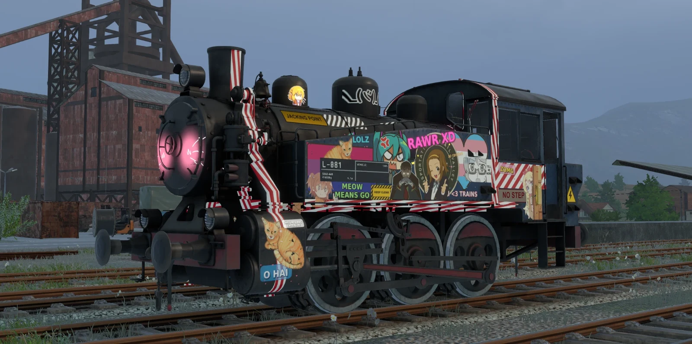

# Dad's Decals wiki

Dad's Decals lets you put decals on any Derail Valley loco, tender or wagon: numbers, logos, stripes, placards, your own PNGs or text in any Windows font. Decals wrap around the bodywork like paint, pick up the game's lighting, shadows and fog, and each car remembers its own layout.

## Pages
| Page | What's in it |
|---|---|
| [Installation](Installation.md) | Requirements, installing, updating, uninstalling |
| [Placing decals](Placing-Decals.md) | The panel, the Place tab, aiming, Keep level, snapping, mirroring |
| [Editing decals](Editing-Decals.md) | Selecting, moving, changing settings, attaching to bogies, undo |
| [Text and road numbers](Text-and-Road-Numbers.md) | Text decals, fonts, outlines and auto-numbering tokens |
| [Colour, finish and weathering](Colour-Finish-and-Weathering.md) | Tint, colour picker, finish presets, glow, grime, chipping |
| [Layouts and sharing](Layouts-and-Sharing.md) | Saving, templates, copying, export/import, layouts per paint scheme, orphans |
| [Your own images](Your-Own-Images.md) | Adding PNGs, categories, image tips, the included examples |
| [FAQ and troubleshooting](FAQ-and-Troubleshooting.md) | Common questions and fixes |
| [How it works](How-It-Works.md) | Technical notes and building from source |

## The 30-second version
1. Free the cursor and open **Decals** on the Mod Toolbar.
2. In the **Place** tab, click an image (or switch to **Text** and type something).
3. Point at a car. A preview follows the mouse. Left-click to place; right-click to stop.
4. Use the **Edit** tab to select, move and adjust what you've placed.
5. Save your game. Decals are stored with each car in the save.
