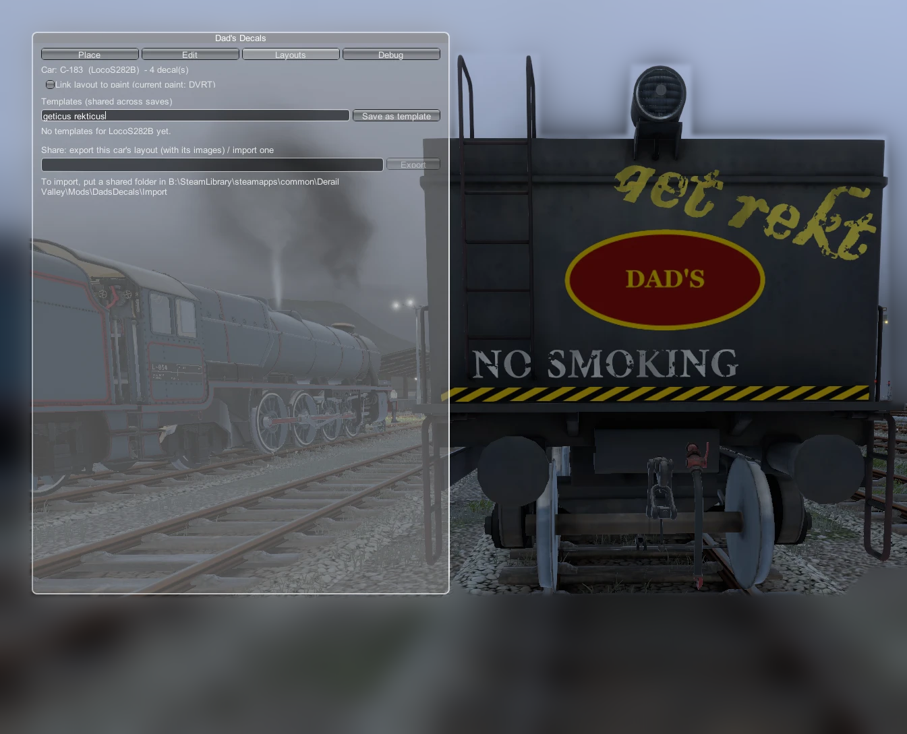

# Layouts and sharing



A **layout** is the set of decals on one car. This page covers how layouts are saved, reused and shared.

## How layouts are saved
- Each car's layout is stored **in your save game**, under the car's own identity. Vanilla, CCL and LocoOwnership-owned cars all work.
- Layouts are written when the game saves, and come back when the car is loaded.
- Each save slot has its own layouts.

### When the game replaces a car
Derail Valley deletes and regenerates locos you don't own and aren't using as a work train. The new loco is a different car with a new ID, so it starts clean. Your old decals aren't lost: they're listed under **Orphaned layouts** (up to the 20 most recent) in the Layouts tab.
- **Apply here** adds them to the current car.
- **Forget** discards them.

Owning the loco (for example with LocoOwnership) keeps it from being regenerated.

## Link layout to paint
Tick **Link layout to paint** and the car keeps a **separate set of decals for each paint scheme**. The line shows the current paint.
- When the paint changes (vanilla paint shop, comms radio or a Skin Manager skin), the decals for the old paint are stored away and the decals for the new paint appear.
- Paint it back and the old decals return.
- *Other paints:* lists the schemes that have stored decals.

Turning the link off keeps the current decals and drops the stored sets.

## Templates
Templates are layouts saved as **files**, so they're available in every save.
- **Save as template**: type a name and click. It's saved for this car's livery (e.g. `LocoDE2`).
- The list shows templates for this livery first. **Templates for other cars** shows the rest.
- **Add** puts the template's decals on this car alongside what's already there.
- **Replace** clears the car first.
- **Delete** removes the template file (it asks you to confirm).

Templates work best on the same type of car, because decal positions are stored relative to the car. Combine them with [road number tokens](Text-and-Road-Numbers.md#auto-road-numbers-tokens) to letter a whole fleet from one design.

Files: `Mods/DadsDecals/Templates/<livery>/<name>.json`

## Copy from another car
**Copy from another car in this save** lists every other car with decals. **Copy here** adds its decals to the current car.

## Export and import (sharing)
**Export** writes the current car's layout plus copies of every image it uses into `Mods/DadsDecals/Exports/<name>/`:

```
Exports/My DE2 scheme/
  layout.json
  images/...        the PNGs the layout uses
```

To share it, zip that folder and send it.

To **import** a layout someone sent you:
1. Unzip their folder into `Mods/DadsDecals/Import/`.
2. In the Layouts tab, click **Import here** next to it.

Their images are copied into `Decals/Imported/<name>/`, so they show up in your palette, and the decals are added to the current car. Your own exports are listed too, so you can re-import them on another car.

Undo covers templates, copies, imports and orphans, so you can try one and undo it if you don't like it.
