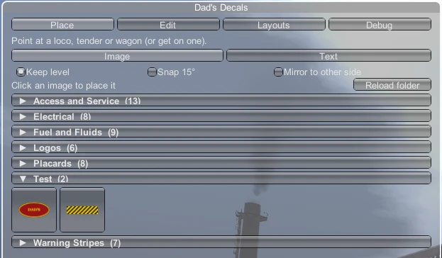
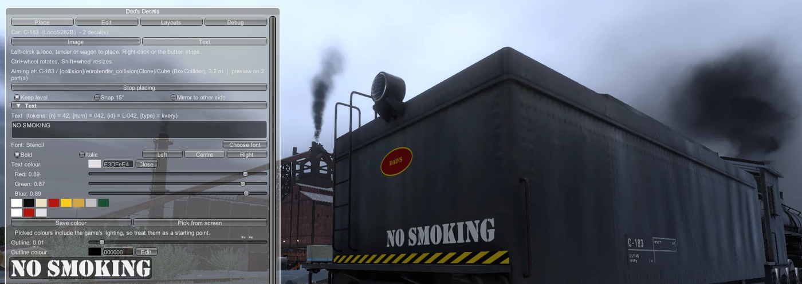

# Placing decals

## The panel
The Decals window has four tabs:

| Tab | For |
|---|---|
| **Place** | Choosing an image or text, setting it up, and placing new decals |
| **Edit** | Selecting, moving and changing decals you've already placed |
| **Layouts** | Templates, copying, export/import and layouts per paint scheme |
| **Debug** | Aim readout and diagnostics, for troubleshooting |

Under the tabs, the **Car:** line shows which car the panel is working on: its ID (e.g. `L-090`), its livery and how many decals it has. That's the car you last pointed at, or failing that the one you're standing on, or failing that your last loco.

Section headers with ▼/► (palette categories, *Size and placement*, *Colour* and so on) fold away when you click them. Folded sections are remembered between sessions.

## Placing an image
1. In the **Place** tab, make sure **Image** is selected at the top.
2. Click an image in the palette. It shows as pressed, and placing mode starts.
3. Move the mouse over any loco, tender or wagon. A **preview** of the decal follows the cursor and wraps around the bodywork.
4. **Left-click** to place it. You stay in placing mode, so you can keep clicking to place more copies.
5. **Right-click**, click the image again, or press **Stop placing** to finish.

While placing, the panel shows an **Aiming at:** line and how many parts the preview is drawn on. It's mainly useful if the preview doesn't appear (see [FAQ](FAQ-and-Troubleshooting.md)).

## Placement options
These sit just above the palette:

- **Keep level** (on by default): the decal is projected straight onto the nearest flat face of the car (side, top or end), and the image is kept upright relative to the car. This gives straight, horizontal numbers even on a curved boiler. With it off, the decal follows the exact angle of the surface where you click.
- **Snap 15°**: rotation moves in 15° steps.
- **Mirror to other side**: each click places **two** decals, one where you clicked and a mirror copy on the opposite side of the car. Text still reads correctly on both sides. The pair is **linked**: editing one updates the other (see [Editing decals](Editing-Decals.md#mirrored-pairs)).

## Mouse shortcuts while placing
| Input | Does |
|---|---|
| Left-click on a car | Place the decal |
| Right-click | Stop placing |
| **Ctrl + mouse wheel** | Rotate the next decal (5° steps, or 15° with snap) |
| **Shift + mouse wheel** | Make the next decal bigger or smaller |

> The game's exterior camera also zooms with the mouse wheel, so it may zoom while you resize. The sliders in the panel do the same job without that.

## Settings for the next decal
Everything below **Settings for the next decal** applies to the decals you're about to place:

- **Size and placement:**
  - **Width** in metres. **Keep image proportions** sets the height from the image shape.
  - **Rotation**.
  - **Projection depth**: how far into the bodywork the decal reaches. Raise it if a decal doesn't reach the surface.
  - **Wrap angle**: how far round a curve it's allowed to go before stopping.
  - **Opacity** and **Flip horizontally/vertically**.
- **Colour, Finish, Weathering:** see [Colour, finish and weathering](Colour-Finish-and-Weathering.md).

## Where decals attach
A decal sticks to the part you clicked:
- the **car body**, or
- a **bogie** (or an articulated engine unit on locos like the Big Boy).

It's only drawn on that part, so a decal on the body doesn't smear onto a bogie that swings underneath it, and a decal on a bogie turns with it. You can change the attachment later in the Edit tab.

Avoid placing on animated parts inside a bogie, like rods and valve gear. The decal stays fixed to the bogie, so it slides as the rods move.

## Saving
Decals are stored **in your save game**, per car. They're written when the game saves, so save before quitting.
