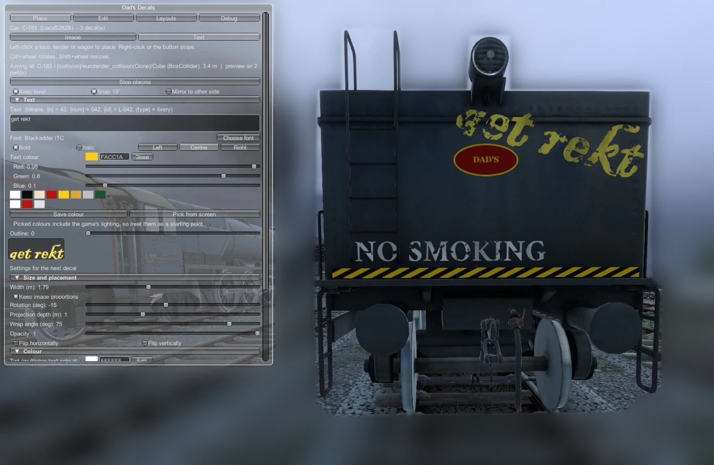

# Text and road numbers

Text decals let you type numbers, names and lettering without making an image first.

## Making a text decal
1. In the **Place** tab, click **Text** at the top.
2. In the **Text** section, type your text. Press Enter for more lines.
3. Choose a font, style and colours (below). A preview appears under the settings.
4. Click **Place this text**, then click on a car as usual.

To change the text of a decal you've placed, select it in the **Edit** tab. Its **Text** section appears there.

## Text settings
| Setting | Notes |
|---|---|
| **Font** | **Choose font** lists every font installed in Windows, with a search box. To use a new font, install it in Windows and restart the game. |
| **Bold / Italic** | Uses the font's own bold/italic where it has one |
| **Left / Centre / Right** | Alignment of multi-line text |
| **Text colour** | The letter colour. The colour picker is described in [Colour, finish and weathering](Colour-Finish-and-Weathering.md). |
| **Outline** | Thickness of an outline around the letters (0 = none) |
| **Outline colour** | Shown when the outline is above 0 |

The decal's **Tint** (in the Colour section) multiplies the whole text, including the outline. Leave it white unless you want to shade everything.

## Sharpness
There's no font-size setting: the decal's **width** *is* the size of the lettering on the car. The mod renders the text at a resolution that matches the decal's real size, so big numbers stay crisp. It picks one of four levels (128, 256, 512 or 768 pixels per line of text).

## Auto road numbers (tokens)
Put these in the text and they're replaced with values from the car the decal is on:

| Token | On car `L-042` (DE2) | Notes |
|---|---|---|
| `{n}` | `42` | Number without leading zeros |
| `{num}` | `042` | Number as in the ID |
| `{id}` | `L-042` | The full car ID |
| `{type}` | `LocoDE2` | Livery ID |

While you type, the panel shows what the text will say on the current car.

Combined with templates, you can design one layout with `{n}` on the cab sides, save it as a template, and apply it to every loco of that type. Each one shows its own number.

> Car IDs change if the game deletes and regenerates a car, so a regenerated loco gets a new number on its decals too.

## Examples
- `No. {n}` → `No. 42`
- `DVRT\n{n}` (two lines) → `DVRT` above `42`
- `{id}` → `L-042`
